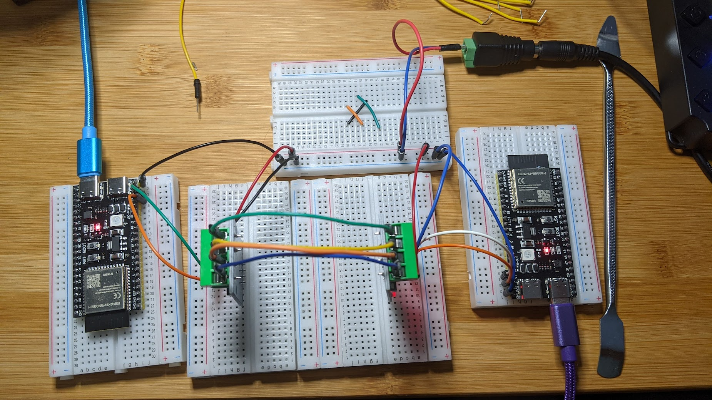

## ESP32 RS-422  Example
This is almost exactly the same as the Simple UART example, except here we add [RS-422](https://en.wikipedia.org/wiki/RS-422) modules.


## Prerequisites

- Same as [simple uart](https://github.com/jouellnyc/UART/tree/main/esp32_simple)
- 2 x RS-422 modules. [These](https://www.amazon.com/gp/product/B0C1C3VHZW/) were used:


but are not labelled properly.

- However [These](https://www.aliexpress.us/item/3256806376131903.html) worked perfectly and are labelled properly:


but they don't fit well on a breadboard.


## Physical Connections

###  Upfront Notes on Power

- A 5V wall power brick "makes ground and 5V available" on a shared bread board.

Why? Neither of these esp32 devices seemed to give adequate output power to power the modules (which use a MAX390 chip).
Such is life with esp32 boards. I intend to retry with esp32's from Espressif themselves versus those used here.
-  USB is used to power the esp32s.



###  Ground Pins on ESP32 

Each esp32  connects it's GND pin to the shared breadboard.


###  TTL Pins from ESP32 to RS-422 Module

Each esp32  connects it's RX/TX to the modules RX/TX, respectively:
 
|  ESP32  | RS-422 Module Pin |
|---|---|
| GPIO 13  | TX |
| GPIO 14  | RX |

Note we still use UART2 and remap as in  [simple uart](https://github.com/jouellnyc/UART/tree/main/esp32_simple)


### RS-422 Module Pins 

1. **Power Supply Connections**

    - Connect the VCC pin of each module to the power rail on the shared breadboard.
    - Connect the GND pin of each module to the ground rail on the shared breadboard.

    ```markdown
    | Module 1 | Breadboard | Module 2 |
    |----------|------------|----------|
    | VCC      | VCC Rail   | VCC      |
    | GND      | GND Rail   | GND      |
    ```

2. **Data Line Connections**

    - Connect the **Y** pin of Module 1 to the **B** pin of Module 2.
    - Connect the **Z** pin of Module 1 to the **A** pin of Module 2.
    - Connect the **Y** pin of Module 2 to the **B** pin of Module 1.
    - Connect the **Z** pin of Module 2 to the **A** pin of Module 1.
    - Use jumper wires to make the connections as described above.

    ```
    Breadboard View:

    +-----------------------------------------+
    |  RS422 Module 1        RS422 Module 2   |
    |  [VCC] --+------------- [VCC]           |
    |  [GND] --+------------- [GND]           |
    |  [ Y ] --+------------- [ B ]           |
    |  [ Z ] --+------------- [ A ]           |
    |  [ Y ] --+------------- [ B ]           |
    |  [ Z ] --+------------- [ A ]           |
    +-----------------------------------------+
    ```


4. Full Example Code
- Same as [simple send and receive example](https://github.com/jouellnyc/UART/blob/main/esp32_simple/send_and_receive.py).

## License
This project is licensed under the [MIT License](LICENSE).
Feel free to modify the content as needed, such as adding installation instructions, code examples, or any other relevant information for your project.

## References 
Here are more details in terms of the "Why I did it this way":
- [Reddit Post on the RS-422 and Esp32's](https://www.reddit.com/r/embedded/comments/1cuo52g/comment/l4qclpu/?context=3)
- [Very helpful starting material - esp32io.com](https://esp32io.com/tutorials/esp32-rs422)
- [Excellent rs-422 vs rs-485 blog](https://www.netburner.com/learn/introduction-to-rs485-and-rs422-standards/)

## Takeaways / Learnings
- Success here was dependant on having the right power (in this case 5V external to the esp32) to the RS-422 Modules.
- The modules (and RS-422) allowed for bi-directional sending and receiving of data due to 4 wires - one pair for sending and one for receiving without any modifications to the [simple send and receive example](https://github.com/jouellnyc/UART/blob/main/esp32_simple/send_and_receive.py).
- Note that the Jessine modules are generally labelled backwards. I needed to connect `Tx` to `Tx` and `Rx` to `Rx` vs the opposite.
 
## License
This project is licensed under the [MIT License](LICENSE).
Feel free to modify the content as needed, such as adding installation instructions, code examples, or any other relevant information for your project.

