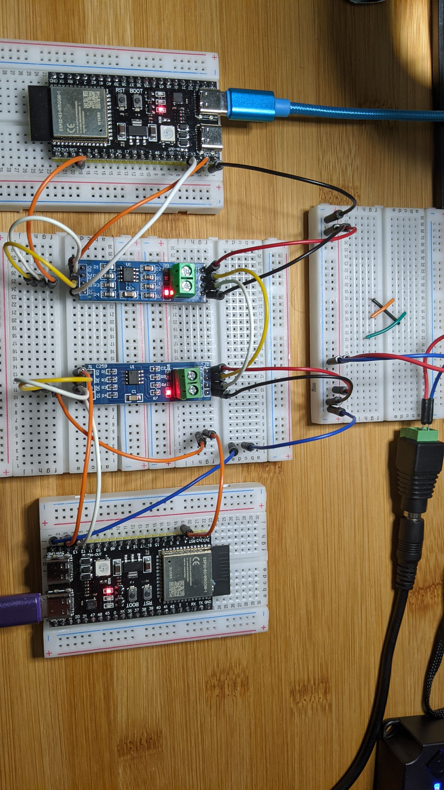

## ESP32 RS-485  Example
This is similar the Simple UART example and RS-422 example, except here we add [RS-485](https://en.wikipedia.org/wiki/RS-485) modules.


## Prerequisites

- Same as [simple uart](https://github.com/jouellnyc/UART/tree/main/esp32_simple)
- Also, 2 x RS-485 modules. [These](https://www.aliexpress.us/item/3256805229452181.html) were used.


## Physical Connections

###  Upfront Notes on Power

- As with the RS-422 setup, a 5V wall power brick "makes ground and 5V available" on a shared bread board for the RS-485 modules.
- Also each esp32 is still itself powered via USB.



###  Ground Pins on ESP32 

Each esp32  connects it's GND pin to the shared breadboard.


###  TTL Pins from ESP32 to RS-485 Module

(On the side opposite the Terminal Block:)
 
| RS-485 Module | ESP32          |
|------------------------|----------------|
| RO (Receiver Output)   | GPIO 14 (RX)   |
| DI (Driver Input)      | GPIO 13 (TX)   |
| DE (Driver Enable)     | GPIO 4         |
| RE (Receiver Enable)   | GPIO 4         |

Note: DE and RE are jumpered together and then reach across to be both managed by GPIO 4 (Orange wire in the pic) 


###  RS-485 Pins from  Module 1 to  Module 2

(On the side with the Terminal Block:)

| RS-485 Module | ESP32          |
|------------------------|----------------|
| GND   | GND (shared on bb)  |
| VCC   | NA - just shared on bb |


| RS-485 Module 1  | RS-485 Module 2      |
|------------------------|----------------|
| GND   | GND (shared on bb)  |
| VCC   | VCC (shared on bb)  |
| A   | A |
| B   | B |

Note we still use UART2 and remap as in  [simple uart](https://github.com/jouellnyc/UART/tree/main/esp32_simple)

### Changes to the Basic UART code

- We need to use GPIO to set DE/RE pins high/low  to send/receive as appropriate.
- We do that with the orange GPIO 4 pin jumpered to DE/RE as mentioned above.


```
uart = machine.UART(2, baudrate=9600, tx=tx_pin, rx=rx_pin)
de_pin = machine.Pin(4, machine.Pin.OUT)
```
  
```  
#To Receive
de_pin.value(0)
print(uart.readline())
```

OR

```
#To Send 
de_pin.value(1)
uart.write('hi')
```


## Full Example Code

To simply send from one esp32 to the other (Simplex Operation):

- Run `simple_receive.py` on esp1 and `simple_send.py` on esp2

To  simpulate a Full Duplex Operation: 

- Run `ping_serv.py` on esp1 and `uart_ping.py` on esp2


## References 
XXX

## Takeaways / Learnings
XXX


## License
This project is licensed under the [MIT License](LICENSE).
Feel free to modify the content as needed, such as adding installation instructions, code examples, or any other relevant information for your project.

