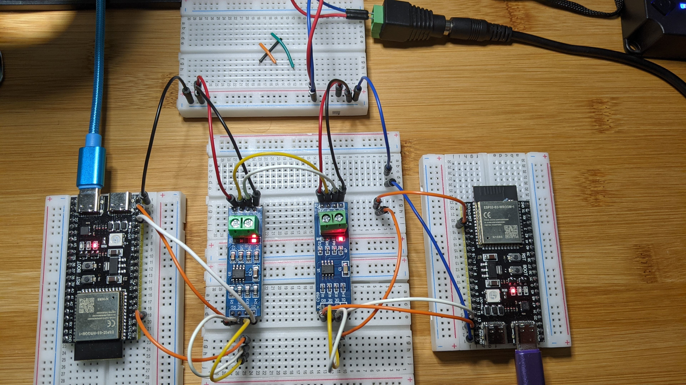

## ESP32 RS-485  Example
This is similar the Simple UART example and RS-422 example, except here we add [RS-485](https://en.wikipedia.org/wiki/RS-485) modules.


## Prerequisites

- Same as [simple uart](https://github.com/jouellnyc/UART/tree/main/esp32_simple)
- Also, 2 x RS-485 modules. [These](https://www.aliexpress.us/item/3256805229452181.html) were used.


## Physical Connections

###  Upfront Notes on Power

- As with the RS-422 setup, a 5V wall power brick "makes ground and 5V available" on a shared bread board for the RS-485 modules.
- Also each esp32 is still itself powered via USB.


###  Ground Pins on ESP32 

Each esp32  connects it's GND pin to the shared breadboard.


###  TTL Pins from ESP32 to RS-485 Module

(On the side opposite the Terminal Block:)
 
| RS-485 Module | ESP32          |
|------------------------|----------------|
| RO (Receiver Output)   | GPIO 14 (RX)   |
| DI (Driver Input)      | GPIO 13 (TX)   |
| DE (Driver Enable)     | GPIO 4         |
| RE (Receiver Enable)   | GPIO 4         |

Note: DE and RE are jumpered together and then reach across to be both managed by GPIO 4 (Orange wire in the pic) 


###  RS-485 Pins from  Module 1 to  Module 2

(On the side with the Terminal Block:)

| RS-485 Module | ESP32          |
|------------------------|----------------|
| GND   | GND (shared on bb)  |
| VCC   | NA - just shared on bb |


| RS-485 Module 1  | RS-485 Module 2      |
|------------------------|----------------|
| GND   | GND (shared on bb)  |
| VCC   | VCC (shared on bb)  |
| A   | A |
| B   | B |

Note we still use UART2 and remap as in  [simple uart](https://github.com/jouellnyc/UART/tree/main/esp32_simple)

### Changes to the Basic UART code

- We need to use GPIO to set DE/RE pins high/low  to send/receive as appropriate.
- We do that with the orange GPIO 4 pin jumpered to DE/RE as mentioned above.


```
uart = machine.UART(2, baudrate=9600, tx=tx_pin, rx=rx_pin)
de_pin = machine.Pin(4, machine.Pin.OUT)
```
  
```  
#To Receive
de_pin.value(0)
print(uart.readline())
```

OR

```
#To Send 
de_pin.value(1)
uart.write('hi')
```


## Full Example Code

To simply send from one esp32 to the other (Simplex Operation):

- Run `simple_receive.py` on esp1 and `simple_send.py` on esp2
  


What you'll notice if you try to send and receive in a full duplex mode is that it won't work. However, to  simpulate a Full Duplex Operation: 


- Run `ping_serv.py` on esp1 and `uart_ping.py` on esp2


- Keeping in mind we are quickly trying to change the send wire to be a receive wire. If you switch too quickly or too slowly, it will not work.
- Why? We can't make the send wire a receive wire until the recieve action is done completely.
- See the [comments](https://github.com/jouellnyc/UART/blob/main/esp32_rs485/uart_ping.py#L20) 

## References 
- https://esp32io.com/tutorials/esp32-rs422
- https://electronics.stackexchange.com/questions/448868/rs422-and-rs485-full-duplex-or-half-duplex
- https://forum.arduino.cc/t/how-to-wire-full-duplex-rs-485-module/1096851
- https://www.renesas.com/us/en/document/rep/rs-485-transmitting-full-duplex-data-over-single-twisted-pair-cable
- https://knowledge.ni.com/KnowledgeArticleDetails?id=kA03q000000YGwxCAG&l=en-US

## Takeaways / Learnings
- If you want full duplex with RS-485 you'll need 4 wires, like RS-422, however we were able to simulate such a thing.
- If reading off of an infinite `while True` loop, uart.readline() performed better when using a small `time.sleep(.1)` vs let the cpu spin %100. (See [Claude's reasoning Why](why_claude.txt))
- Given a distance of a few inches and 9600 baud, `uart_ping.py`'s lowest latency round trip was about 30 ms, but I needed to wait 5-7 ms to flip the GPIOs and also wait for the data to be send before fully flipping. This was using Dupont Jumpers. See table for other tests.
- Was unable to get the 25 foot to work properly. I moved away the power from the cables to lessen any other interference. This was a fail for now.
- My first test with BNTECHGO 22 AWG Stranded Tinned Copper Wire failed. Just eyeballing a short strip to test it was not long enough to support communication.
- Actually threading the Stranded cable was rough. The best bet is to get either the precise length that fits into the terminal block hole or double that and bend it back nicely:

<table>
  <tr>
    <th>Threading Well</th>
  </tr>
  <tr>
    <td align="center"></td>
  </tr>
</table>


| Cable/Wire | Speed | Baud|length|Pic/Other|
|---|---|---|---|---|
| [Basic Dupont Jumper](https://www.amazon.com/gp/product/B07GD2BWPY/)| 29 ms | 9600 |10 cm | 
| Basic Dupont Jumper                                  | 15 ms | 19200|10 cm | -- | 
| Basic Dupont Jumper                                  | message received, not returned| 38400| 10 cm |  -- | 
| [BNTECHGO 22 AWG Stranded Tinned Copper](https://www.temu.com/goods.html?_bg_fs=1&goods_id=601099513962206&sku_id=17592200180902)        | garbage/NA  | 9600| 8 cm | |
| BNTECHGO 22 AWG Stranded Tinned Copper        | 30 ms | 9600| 25 cm | -- | 
| BNTECHGO 22 AWG Stranded Tinned Copper        | 15-18 ms | 19200| 25 cm |  | 
| BNTECHGO 22 AWG Stranded Tinned Copper | message received, not returned| 38400| 25 cm | -- | 
| BNTECHGO 22 AWG Stranded Tinned Copper | garbage/NA  | 9600, 19200, 38400, 57600, 115200|25 feet | | 
| [22 AWG Gauge Tinned Copper Stranded ](https://www.temu.com/goods.html?_bg_fs=1&goods_id=601099513962206&sku_id=17592200180902)  | 20 ms | 9600, 19200, 38400, 57600, 115200|40 cm | -- | 
| 22 AWG Gauge Tinned Copper Stranded  | 35  ms | 9600| 30 feet | | 
| 22 AWG Gauge Tinned Copper Stranded  | 20 ms | 19200| 30 feet | | 
| 22 AWG Gauge Tinned Copper Stranded  | garbage/NA | 38400| 30 feet | | 


## License
This project is licensed under the [MIT License](LICENSE).
Feel free to modify the content as needed, such as adding installation instructions, code examples, or any other relevant information for your project.
