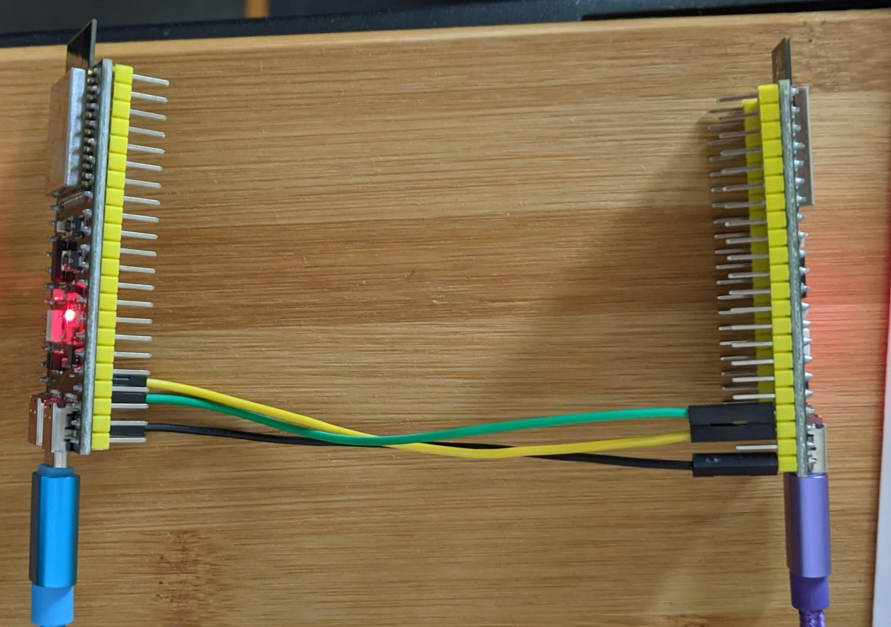
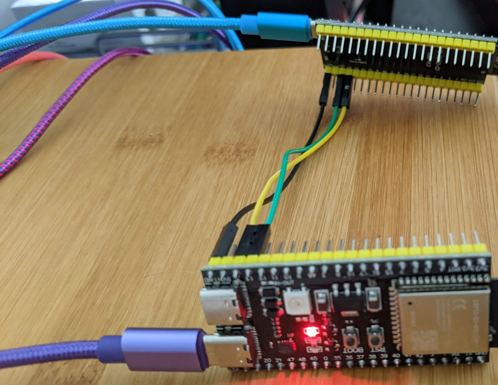
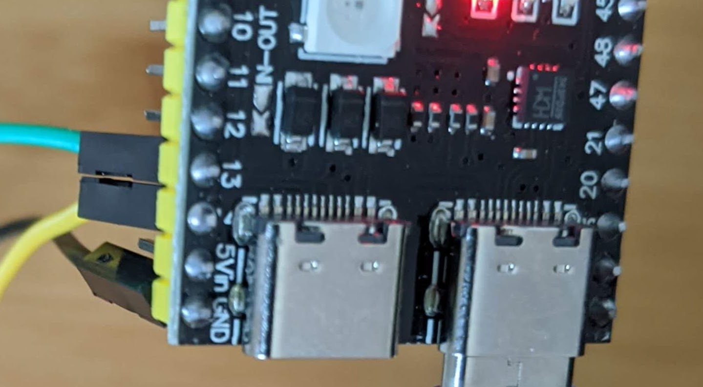
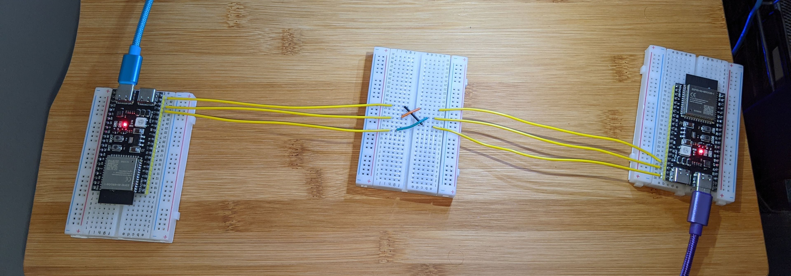

## ESP32 UART Simple Example

## [ Prerequisites ](#Prerequisites)

- An ESP32 board or module 
    (I used 2 x [ESP32-S3-DevKitC-1 (S3-N16R8)](https://www.aliexpress.us/item/3256806014820995.html) from AliExpress)
 
- MicroPython firmware (I used ["Firmware Support for Octal-SPIRAM"](https://micropython.org/download/ESP32_GENERIC_S3/) and pointed Thonny to the file explicitly.) 


## UART2 Pin Configuration

By default, the ESP32 assigns the following pins to UART2:

- TX: GPIO 17
- RX: GPIO 16

However, if your ESP32 device has SPI RAM enabled, these pins (GPIO 16 and GPIO 17) are dedicated to the SPI RAM interface and cannot be used for UART2. 
In this case, you need to remap the UART2 signals to different GPIO pins.

### UART2 Pin Remapping (with SPI RAM)

When SPI RAM is enabled, you can remap the UART2 signals to the following pins:

- TX: GPIO 14
- RX: GPIO 13

Additionally, you can optionally assign the CTS and RTS pins for hardware flow control:

- CTS: GPIO 8
- RTS: GPIO 7

## Usage

1. Wire the connections:
   - Connect the ESP32's UART2 TX pin to the RX pin of the other device
   - Connect the ESP32's UART2 RX pin to the TX pin of the other device
   - Connect the ground (GND) pins of both devices

NOTE: Pin 14 may be hard to read. See pics for some visual help. 

<table>
  <tr>
    <th>View 1</th>
    <th>View 2</th>
    <th>Pin 13 and 14</th>
    <th>Creative Cabling</th>
  </tr>
  <tr>
    <td align="center"></td>
    <td align="center"></td>
    <td align="center"></td>
    <td align="center"></td>
  </tr>
</table>


2. Configure UART2 in your MicroPython code:

```python
from machine import UART, Pin

# Without SPI RAM
uart2 = UART(2, baudrate=9600, tx=Pin(17), rx=Pin(16))

# With SPI RAM (remapped pins)
uart2 = UART(2, baudrate=9600, tx=Pin(14), rx=Pin(13))

# Optional: Configure CTS and RTS pins for hardware flow control
# uart2 = UART(2, baudrate=9600, tx=Pin(14), rx=Pin(13), cts=Pin(8), rts=Pin(7))
```

3. Full Example 
In Thonny or other IDE, run/import `send_and_receive.py` on each esp32

## Notes
- [Unexpected Make video explains hidden UARTS](https://www.youtube.com/watch?v=3sXtVuMhuoc)
- [ ESP32 Forum post re: UART](https://esp32.com/viewtopic.php?t=30573)
- [Pin out from Espressif](https://docs.espressif.com/projects/esp-idf/en/stable/esp32s3/hw-reference/esp32s3/user-guide-devkitc-1.html)


## License
This project is licensed under the [MIT License](LICENSE).
Feel free to modify the content as needed, such as adding installation instructions, code examples, or any other relevant information for your project.

