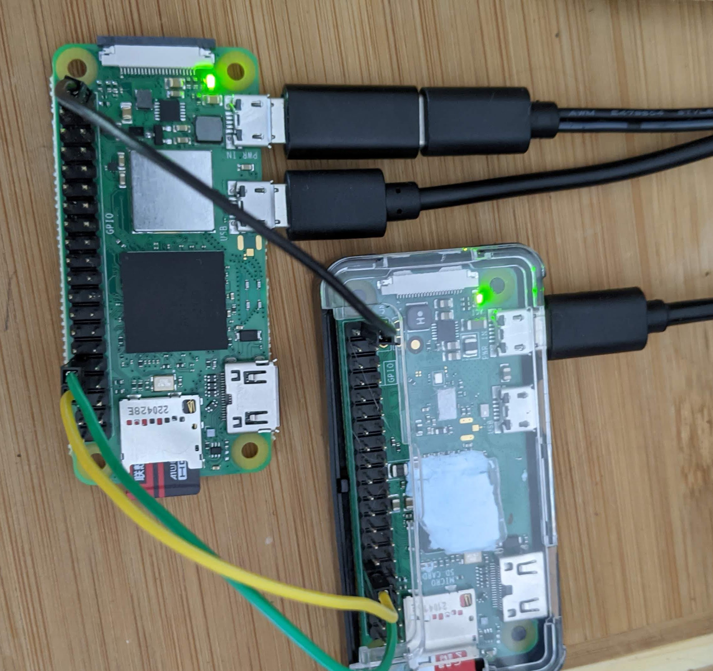

# pizero_simple

PPP server over UART (TTL) with Raspberry Pi Zero 

# Why? 

1 - This is a physically connected alternative to wifi-based [wpa-ent-mschapv2-bridge](https://github.com/jouellnyc/wpa-ent-mschapv2-bridge)

2 - It could simply be fun

# Upfront

| Requirements |
|-----------------|
|A raspbery pi of some sort - I used  2 pi zeros|
|Proper power for the Pi - I use a 1.5A 5V unit with a barrel plug adapter (for easy release / attach)|
|A few dupont jumper cables|
|Header Pins for the Pis|

NOTES: 

- In theory it is possible to use ppp with esp32/micropython as ppp is in the network stack. 


| Cautionary Notes | Description                                             |
|-----------------|---------------------------------------------------------|
| 1. | This is for testing in a lab at home- use caution!|
| 2. | The ppp configs are not hardened - this is just starting out to get you going|


# How To on Raspberry Pi OS 12/BookWorm

The [forum](https://forums.raspberrypi.com/viewtopic.php?t=206074) is about 99% of the battle and is a great read.

I have config.txt and rc.local saved here to make it a bit easier.


## Client 
- /etc/rc.local

```
#!/bin/sh -e
pppd /dev/ttyAMA0 1000000 10.0.5.2:10.0.5.1 noauth local defaultroute debug dump nocrtscts persist maxfail 0 holdoff 1
```

Note that I added 'defaultroute' - you may or may not need this depending on your setup...


## Server

- Turn on ip forwarding

```
echo net.ipv4.ip_forward=1 >> /etc/sysctl.conf
```


- /etc/rc.local

```
#!/bin/sh -e
echo "Starting pppd..."
stty -F /dev/ttyAMA0 raw
pppd /dev/ttyAMA0 1000000 10.0.5.1:10.0.5.2 proxyarp local noauth debug nodetach dump nocrtscts passive persist maxfail 0 holdoff 1

```


## Firewall

- For testing make the firewall wide open (or turn it off) - Initially I could not ping but could see the icmp packets with tcpdump.

``` 
iptables -L 
iptables -P INPUT ACCEPT
iptables -D INPUT 1 # run this a few time
iptables-save > /etc/iptables/rules.v4 
reboot
```

Once set, harden as you like

## Routing


I addeded the defaultroute option on the client and turned off all wifi. Here's the table:


```
# route -n
Kernel IP routing table
Destination     Gateway         Genmask         Flags Metric Ref    Use Iface
10.0.5.1        0.0.0.0         255.255.255.255 UH    0      0        0 ppp0

# ip a
1: lo: <LOOPBACK,UP,LOWER_UP> mtu 65536 qdisc noqueue state UNKNOWN group default qlen 1000
    link/loopback 00:00:00:00:00:00 brd 00:00:00:00:00:00
    inet 127.0.0.1/8 scope host lo
       valid_lft forever preferred_lft forever
    inet6 ::1/128 scope host noprefixroute 
       valid_lft forever preferred_lft forever
2: ppp0: <POINTOPOINT,MULTICAST,NOARP,UP,LOWER_UP> mtu 1500 qdisc pfifo_fast state UNKNOWN group default qlen 3
    link/ppp 
    inet 10.0.5.2 peer 10.0.5.1/32 scope global ppp0
       valid_lft forever preferred_lft forever
    inet6 fe80::e471:dc1d:6c1a:a3b7 peer fe80::d842:ca2f:ffce:2628/128 scope link 
       valid_lft forever preferred_lft forever
3: wlan0: <NO-CARRIER,BROADCAST,MULTICAST,UP> mtu 1500 qdisc pfifo_fast state DOWN group default qlen 1000
    link/ether b8:27:eb:b3:0c:e6 brd ff:ff:ff:ff:ff:ff

```


## Pins

- Make sure the TX is connected to the RX of the other pi for both jumpers (GPIO 14 , 15). 
- Also have a shared ground (GPIO 39 is one) and used in the pic below. 
- See https://pinout.xyz/

## Pic




## References

[Super User Default Route](https://superuser.com/questions/949520/wvdial-ppp0-and-setting-default-route-automatically)

[ PPP HOWTO - def route ](https://tldp.org/HOWTO/PPP-HOWTO/x452.html)


